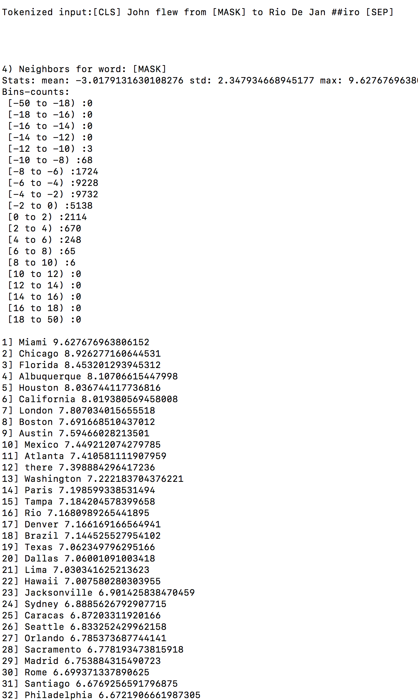

# bert_descriptors
BERT's MLM head model exposed as a HTTP service

# Installation

Setup pytorch environment with/without GPU support using link https://github.com/ajitrajasekharan/multi_gpu_test

*Make sure to follow conda environment activation instructions. Also tensorflow is not required. So we just neeed to run first.sh, second.sh and third.sh (from 1-4) performing the instructions displayed at end of each step *

# Usage 

Start server

  $ ./run_server.sh
  

Confirm installation works by

$ wget -O DES "http://127.0.0.1:8087/dummy/John flew from entity to Rio De Janiro"

The output DES file should contain

  
 
 
 # License
 
 MIT License

